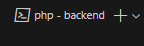
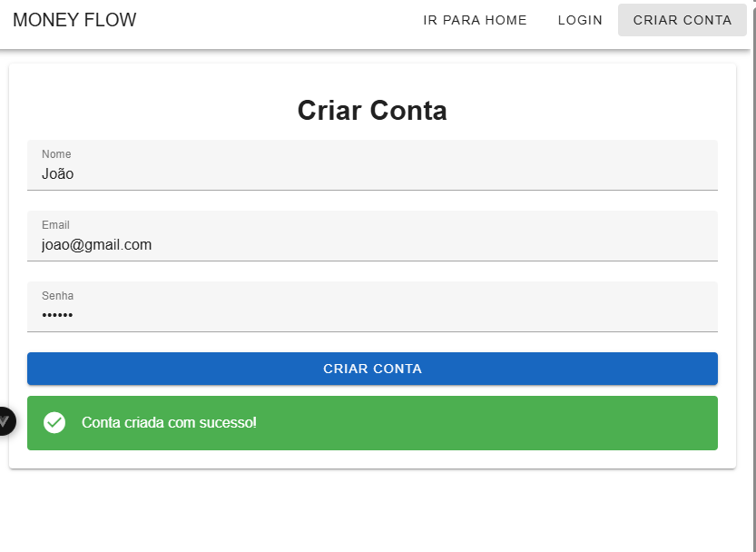

Introdução:
Sistema de Gerenciamento de Movimentações

Aplicação desenvolvida com Vue 3 e PHP/Laravel 12.
O Sistema de Gerenciamento de Movimentações é uma aplicação eficiente, focada nos usuários, que tem o intuito de organizar e gerenciar movimentações financeiras de forma simples, eficaz e rápida. Unificando em apenas um lugar as principais informações: Data da criação, Tipo: (entrada ou saída),Valor R$, Categoria e Descrição.

Para iniciar o uso da aplicação é necessário ter os seguintes programas instalados na máquina:

1 -  Editor de código de sua preferência. No exemplo irei usar o VsCode, mas o passos serão os mesmos.Link oficial(https://code.visualstudio.com/)

2 - Baixar o XAMPP para usar o banco de dados e compilar código na linguagem PHP. Link oficial(https://www.apachefriends.org/pt_br/index.html)

3- Baixar o COMPOSER para gerenciar pacotes no PHP. Link oficial(https://getcomposer.org/download/)

4 - Baixar o Git para download do código.
Link oficial (https://git-scm.com/downloads) 

5 - Opção de download do arquivo pelo GitHub:
Link do repositório (https://github.com/Devine-ops/teste_php_vue/tree/main)

Baixar o arquivo no botão: Download ZIP.

Com os aplicativos baixados e instalados seguiremos adiante.

Ligar o servidor XAMPP:

Para iniciar, devemos abrir o XAMPP, para nosso banco de dados e servidor APACHE local.

Devemos clicar em “START” no APACHE, e também no MySQL “START”.

Após o servidor Apache e o MySql ligado, ficará da seguinte forma:

com o servidor ligado prosseguiremos.

Clonar repositório via Git:

no terminal do seu editor de código digite o comando 

git clone https://github.com/Devine-ops/teste_php_vue

o repositório será baixado.

Ou abrir o arquivo usando o seu Editor de código de preferência.

Logo após o download do repositório. Abra o arquivo seu editor de códigos.

Instalar o COMPOSER e iniciar o SERVIDOR:

1 - Abra o terminal navegue até o arquivo “backend”
comando: cd backend

2- instale o composer com o seguinte comando:
comando: composer install

As dependências serão instaladas é necessário aguardar até que todas sejam instaladas.

Aparecerá as informações abaixo, isso significa que está tudo CERTO.

Conectar banco de dados:

1 - Acessar o link (http://localhost/phpmyadmin/index.php)

Essa é a tela do seu banco de dados MySql

Note que já existem alguns bancos de dados presentes que já vem por padrão no XAMPP.

2 - Vá até o seu editor de código click no arquivo backend.

Clique no arquivo .env.example.

Copie todo conteúdo do arquivo.

Use o atalho Ctrl+a para selecionar.
Use o atalho Crtl+c para copiar.

3 - Crie um arquivo chamado .env dentro do da pasta backend.
E cole o conteúdo do copiado anteriormente.

Se preferir no terminal digite o comando:
copy .env.example .env

Esse comando ira gera uma cópia do arquivo .env.example com nome .env.

4 - Clique no arquivo .env e vamos às configurações.

Procure por:

Essas são as configurações do banco de dados que será criado para a aplicação, mas nós iremos modificar para utilizar o MySql.

Clique em no símbolo (#). E aperte as teclas Crtl+d

Esse atalho selecionará todas os simbolos (#). Agora apague!

5 - Vamos às edições.

Substitua De:

DB_CONNECTION=sqlite
DB_HOST=127.0.0.1
DB_PORT=3306
DB_DATABASE=laravel
DB_USERNAME=root
DB_PASSWORD=

Para:

DB_CONNECTION=mysql
DB_HOST=127.0.0.1
DB_PORT=3306
DB_DATABASE=gestao_financeira
DB_USERNAME=root
DB_PASSWORD=

Lembrando que o nome DB_DATABASE pode ser qualquer um que você queira.

6 - Agora podemos rodar o comando para criação da base de dados “gestao_financeira”.
comando: php artisan migrate

Vai surgir essa pergunta, informando que a database gestao_financeira não existe. você deseja criar ?

Apenas digite enter pois (yes) está selecionado por padrão.

Todas as tabelas serão criadas. E você pode verificar no link (http://localhost/phpmyadmin/index.php)

Pronto, agora você já tem um banco de dados pronto para ser utilizado.

Iniciar o Backend:

Agora podemos rodar o comando, para iniciar o servidor:
php artisan serve

OBS(para parar o servidor basta clicar as teclas Ctrl+C).

Servidor “OK”, podemos prosseguir”!

Iniciar o Frontend:

1 -  Abra um novo terminal no ícone de (+) indicado abaixo:

2 - Navegue para pasta do frontend
comando: cd frontend

Instale as dependências com o comando:
npm install

3 - Ligue o Frontend com o comando:
npm run dev

4 - Para abrir a aplicação você deve segurar a tecla Crtl e clicar no link (http://localhost:5173/)

Tela inicial:

1 - Para iniciar a usar o sistema basta criar uma conta, clicando em: (CRIAR CONTA).

2 - Insira os dados solicitados e podemos criar um exemplo genérico.

Nome: João
Email: joao@gmail.com
Senha: 123456

Uma mensagem de criação de conta irá surgir e você será redirecionado para o login em 3 segundos.

Para logar basta colocar as credenciais.

Dashboard de Movimentações:

Para poder adicionar uma movimentação, devemos antes criar uma categoria.

1 - Clicar no botão (CRIAR CATEGORIA).

2 - Inserir um nome da categoria, por exemplo: CARRO.

Clicar em criar!

Depois da categoria criada podemos criar uma movimentação.
OBS(É necessário preencher todos os dados para funcionar!).

Com todos os dados preenchidos só basta clicar em: ADICIONAR MOVIMENTAÇÃO.

Logo abaixo do formulário para criar uma categoria, será carregada uma tabela com a categoria criada, além de dois botões para EDITAR ou EXCLUIR a movimentação criada.

Para editar basta clicar no botão com ícone de lápis.

Após o clique as informações para a edição irão aparecer no formulário para criar uma nova edição, mas observe que o botão agora está como ATUALIZAR MOVIMENTAÇÃO. Isso significa que você irá editar algo já existente.

Como exemplo irei modificar a descrição de:

Manutenção.

Para:

Troca da suspensão.

Ao clicar em ATUALIZAR MOVIMENTAÇÃO, será atualizada na tabela como na imagem abaixo:

Logout:

Para realizar o logout basta clicar no botão no canto superior direito da tela, e você irá retornar a página inicial.

Informações Técnicas

O backend foi desenvolvido com o framework LARAVEL 12.

Foi utilizado as próprias ferramentas que nele se encontram o SANCTUM para a geração de um token para cada sessão do usuário que é destruído todas as vezes que o logout é solicitado.

Foram criadas rotas para as requisições são elas:

//rota publica
Route::post('/login',[LoginController::class, 'login'])->name('login');
Route::post('/register', [AuthController::class, 'register']);
//rota restrita
Route::group(['middleware' => ['auth:sanctum']], function(){
    Route::get('/users',[UserController::class, 'index']);
    Route::post('/logout',[LoginController::class, 'logout']);
   
    Route::middleware('auth:sanctum')->get('/categorias', [CategoriaController::class, 'index']);
    Route::post('/categorias', [CategoriaController::class, 'store']);

    Route::put('/movimentacoes/{id}', [MovimentacaoController::class, 'update']);
    Route::delete('/movimentacoes/{id}', [MovimentacaoController::class, 'destroy']);
   
    Route::middleware('auth:sanctum')->get('/movimentacoes', [MovimentacaoController::class, 'index']);
    Route::middleware('auth:sanctum')->post('/movimentacoes', [MovimentacaoController::class, 'store']);
});

Públicas: login e registro onde o usuário precisa ter acesso ilimitado pois é necessário para criar a conta e fazer o login.

Privada: As rotas privadas são endpoints que necessitam de uma validação de token utilizada pelo SANCTUM para a validação. Onde o usuário só pode acessar após a criação de conta e um login.

Controllers:

Os controllers foram criados dentro de uma pasta chamada API, para que fizesse sentido já que faz referência às rotas da pasta routes/api.php.

São um total de 5 controllers:

AuthController é responsável pela criação do usuário. Ele valida os dados e cria a conta do usuário caso esteja algo fora do padrão da autenticação será emitido um erro na tela de Registro de conta.
<?php

namespace App\Http\Controllers\Api;

use App\Http\Controllers\Controller;
use Illuminate\Http\Request;
use App\Models\User;
use Illuminate\Support\Facades\Hash;
use Illuminate\Support\Facades\Validator;

class AuthController extends Controller

{

    public function register(Request $request)
    {
        // Validação dos dados recebidos
        $validator = Validator::make($request->all(), [
            'name' => 'required|string|max:255',
            'email' => 'required|string|email|max:255|unique:users',
            'password' => 'required|string|min:6',
        ]);

        if ($validator->fails()) {
            return response()->json([
                'message' => 'Dados inválidos!',
                'errors' => $validator->errors()
            ], 422);
        }

        // Criando o usuário
        $user = User::create([
            'name' => $request->name,
            'email' => $request->email,
            'password' => Hash::make($request->password),
        ]);

        return response()->json([
            'message' => 'Conta criada com sucesso!',
            'user' => $user
        ], 201);
    }
}

CategoriaController é responsável pela criação das categorias e pela função HTTP GET que exibe as categorias criadas e pela função POST que cria uma nova categoria. É uma rota privada só pode ser acessada com autenticação via token.
<?php

namespace App\Http\Controllers\Api;

use App\Http\Controllers\Controller;
use Illuminate\Http\Request;
use App\Models\Categoria;

class CategoriaController extends Controller
{
    public function index()
    {
        return response()->json(Categoria::all());
    }

    public function store(Request $request)
    {
        $request->validate(['nome' => 'required|unique:categorias|max:255']);

        $categoria = Categoria::create(['nome' => $request->nome]);

        return response()->json(['message' => 'Categoria criada!', 'categoria' => $categoria]);
    }
}

LoginController é responsável pelas funções de login e logout. No Login ele gera um token que é responsável pela autenticação da sessão do usuário.
Na parte do logout o usuário solicita o logout e o token é destruído.
<?php

namespace App\Http\Controllers\Api;

use App\Http\Controllers\Controller;
use Illuminate\Support\Facades\Auth;
use Illuminate\Http\Request;
use Exception;
use App\Models\User;

class LoginController extends Controller
{
    public function login(Request $request)
    {   //validar email e senha
        if(Auth::attempt(['email' => $request->email, 'password'=> $request->password])){
            //recupera dados do user
            $user = Auth::user();

            $token = $request->user()->createToken('api-token')->plainTextToken;

            return response()->json([
                'status' => true,
                'message' => 'Logado!',
                'user' => $user,
                'token' => $token
            ],201);
        }else{
            return response()->json([
                'status' => false,
                'message' => 'Login ou senha incorreta!'
            ],404);
        }
    }
 
    // Função de logout
    public function logout(Request $request)
{
    try {
        // Acessar o usuário autenticado via middleware auth:sanctum
        $user = Auth::user();

        // Revogar o token atual
        $request->user()->currentAccessToken()->delete();

        return response()->json([
            'status' => true,
            'message' => 'Deslogado com sucesso.',
        ], 200);
    } catch (Exception $e) {
        return response()->json([
            'status' => false,
            'message' => 'Não deslogado.',
        ], 400);
    }
}

}

MovimentacaoController é a função que gerencia a o GET para que as movimentações sejam visíveis no Frontend. Ela valida com o user_id e o Auth::id que apenas o usuário logado na sessão veja suas próprias movimentações.

A função store cria uma nova movimentação validando a entrada de dados e depois criando a movimentação em si.

A função destroy deleta a movimentação solicitada usando o seu id.

A função update encontra a movimentação pelo id, verifica se o usuário é o dono logo após isso valida os dados recebidos e atualiza a movimentação.

<?php

namespace App\Http\Controllers\Api;

use App\Models\Movimentacao;
use Illuminate\Http\Request;
use App\Http\Controllers\Controller;
use Illuminate\Support\Facades\Auth;

class MovimentacaoController extends Controller
{
    public function index()
    {
        $movimentacoes = Movimentacao::where('user_id', Auth::id())->get();
        return response()->json($movimentacoes);
    }

    public function store(Request $request)
    {
        $request->validate([
            'date' => 'required|date',
            'type' => 'required|in:entrada,saida',
            'value' => 'required|numeric',
            'category' => 'required|string|max:255',
            'description' => 'required|string|max:500',
        ]);

        $movimentacao = new Movimentacao();
        $movimentacao->user_id = Auth::id();
        $movimentacao->date = $request->date;
        $movimentacao->type = $request->type;
        $movimentacao->value = $request->value;
        $movimentacao->category = $request->category;
        $movimentacao->description = $request->description;
        $movimentacao->save();

        return response()->json(['message' => 'Movimentação criada com sucesso!'], 201);
    }

    public function destroy($id)
    {
        // Encontra a movimentação pelo ID
        $movimentacao = Movimentacao::find($id);

        if (!$movimentacao) {
            return response()->json(['message' => 'Movimentação não encontrada'], 404);
        }

        // Deleta a movimentação
        $movimentacao->delete();

        return response()->json(['message' => 'Movimentação deletada com sucesso']);
    }

    public function update(Request $request, $id)
    {
        // Encontra a movimentação pelo ID
        $movimentacao = Movimentacao::find($id);

        if (!$movimentacao) {
            return response()->json(['message' => 'Movimentação não encontrada'], 404);
        }

        // Verifica se o usuário é o proprietário da movimentação
        if ($movimentacao->user_id !== Auth::id()) {
            return response()->json(['message' => 'Acesso negado'], 403);
        }

        // Valida os dados recebidos
        $request->validate([
            'date' => 'required|date',
            'type' => 'required|in:entrada,saida',
            'value' => 'required|numeric',
            'category' => 'required|string|max:255',
            'description' => 'required|string|max:500',
        ]);

        // Atualiza os dados da movimentação
        $movimentacao->date = $request->date;
        $movimentacao->type = $request->type;
        $movimentacao->value = $request->value;
        $movimentacao->category = $request->category;
        $movimentacao->description = $request->description;
        $movimentacao->save();

        return response()->json(['message' => 'Movimentação atualizada com sucesso!']);
    }
}

Por último temos o UserController onde para fins de teste podemos listar todos os usuários caso queira usar para criar uma tabela com todos os usuários pode ser usada com POSTMAN ou INSOMINIA.
<?php

namespace App\Http\Controllers\Api;

use App\Http\Controllers\Controller;
use App\Models\User;
use Illuminate\Http\Request;

class UserController extends Controller
{
    public function index()
    {
        $user = User::get();

        return response()->json([
            'status' => 'true',
            'user' => $user
        ]);
    }
}

Models:

Os models são modelos para criar as tabelas no banco de dados.

Foram criados 2 models dentro da pasta models.

1 - categoria: Usada para o campo nome da categoria
<?php

namespace App\Models;

use Illuminate\Database\Eloquent\Factories\HasFactory;
use Illuminate\Database\Eloquent\Model;

class Categoria extends Model
{
    use HasFactory;

    // Defina os campos que podem ser preenchidos
    protected $fillable = ['nome'];
}

2 - movimentacao: usado apra criar uma categoria com os campos abaixo

<?php

namespace App\Models;

use Illuminate\Database\Eloquent\Factories\HasFactory;
use Illuminate\Database\Eloquent\Model;

class Movimentacao extends Model
{
    use HasFactory;

    protected $table = 'movimentacoes';
   
    protected $fillable = [
        'user_id',
        'date',
        'type',
        'value',
        'category',
        'description',
    ];
}

3 - User o model user vem por padrão no laravel e foi utilizado para a criação de conta

Para debugger foi utilizado o arquivo app.php dentro da pasta bootstrap:

    ->withExceptions(function (Exceptions $exceptions) {
        //lança exceção quando houver erro na autenticação
        $exceptions->render(function(AuthenticationException $e){
            return response()->json([
                'status' => false,
                'message' => 'token de autenticação invalido!'
            ]);
        });
    })->create();

Utilização do INSOMINIA para as requisições HTTPS.

URLS:
http://127.0.0.1:8000/api/categorias POST

{
  "nome": "Nova Categoria"
}

http://127.0.0.1:8000/api/movimentacoes GET

É necessário criar conta e logar e também adicionar o token gerado na ab Auth do INSOMINIA

http://127.0.0.1:8000/api/movimentacoes POST 

É necessário criar conta e logar e também adicionar o token gerado na ab Auth do INSOMINIA

http://127.0.0.1:8000/api/register POST

{
  "name": "Seu Nome",
  "email": "email@example.com",
  "password": "senha123"
}

http://127.0.0.1:8000/api/logout/1 POST 

É necessário criar conta e logar e também adicionar o token gerado na ab Auth do INSOMINIA

http://127.0.0.1:8000/api/users GET

Não é necessário inserir nenhuma informação
OBS usada para debugar

http://127.0.0.1:8000/api/login POST

{
	"email": "email@example.com",
	"password": "senha123"
}

http://127.0.0.1:8000/api/movimentacoes PUT

É necessário criar conta e logar e também adicionar o token gerado na ab Auth do INSOMINIA

{
  "date": "2025-03-10",
  "type": "entrada",
  "value": 150.75,
  "category": "Salário",
  "description": "Recebimento de pagamento"
}

